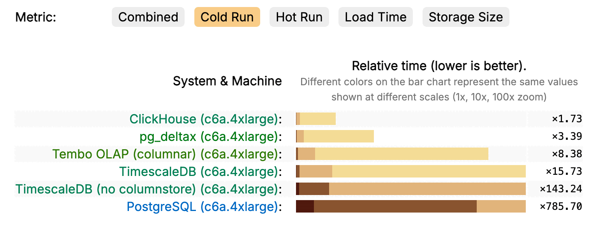
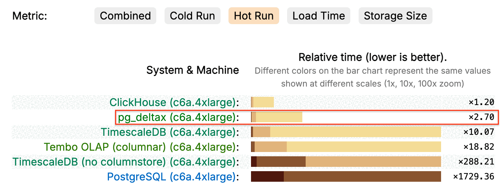

<p align="center">
  <a href="https://github.com/xataio/xata/blob/main/LICENSE"></a>&nbsp;
  <a href="https://twitter.com/xata"></a>&nbsp;
  <a href="https://bsky.app/profile/xata.io"></a>&nbsp;
  <a href="https://www.youtube.com/@xataio"></a>&nbsp;
</p>

# DeltaX (δx) - Fast time-series extension for PostgreSQL

δx is a PostgreSQL extension offering compression and columnar storage for time-series 
data. It can be used as a pure open-source (Apache 2.0) alternative to TimescaleDB or
as a PostgreSQL-native alternative to dedicated analytics stores like ClickHouse, when
you'd like your data to stay in Postgres.

δx stores the compressed data in regular Postgres tables. It does _not_ use its own storage 
format on disk. The advantage of this approach is that features like physical/logical 
replication, crash recovery, backups, and pg_dump work as for any other Postgres table.

δx is currently developed and maintained by the [Xata](https://xata.io) team. We hope other
Postgres providers will offer it as an extension (see the [How can I help](#how-can-i-help)
section).

## Benchmarks

These results are as of May 16th, 2026.

### ClickBench

On the [ClickBench](https://benchmark.clickhouse.com/) benchmark, which runs 43 analytical
queries against a web analytics dataset of 100M rows × 105 columns, δx currently ranks lower than 
specialized analytical stores like ClickHouse and DuckDB, but it is the highest-ranking of 
all the systems that are storing the data in PostgreSQL.


#### Compression / storage size

Looking at the **compression ratio / storage size**, δx offers a compression ratio of about 7× on
this particular dataset. Compression ratios vary considerably by data characteristics.


#### Cold run



#### Hot run



#### Load time


The reason δx can load the data faster than Postgres is that it has support for backfilling data directly
from Parquet files. On a more standard setup where the data is loaded into normal Postgres tables and
then compressed, the load time would be similar to the PostgreSQL result plus the compression time.


### JSONBench

[JSONBench](https://jsonbench.com/) is a benchmark similar to ClickBench but for measuring performance
on semi-structured data. The dataset contains Bluesky firehose data exported as ndjson.

δx has support for extracting particular fields from JSONB columns and compressing them with the same
columnar algorithms as the native columns. This enables the following results on JSONBench.


## How it works

Let's start with an example time-series table partitioned by a timestamp column. The data itself can be metrics, 
logs, events, etc. Anything that contains a timestamp. PostgreSQL has built-in partitioning, so it's very common
to partition time-series data in fixed-interval partitions (e.g. daily, weekly, or monthly). In our example, let's
assume monthly. The partitioned table might look something like this:


Under typical time-series workloads, only the last partition (the current month) receives writes. The rest typically
only receive reads. Based on this observation, the idea is that we can compress older partitions so that they take 
less space.


A naive way to do this is to compress all the data in a given partition with a single algorithm (say, LZ4). However,
it turns out that compressing column by column has two important advantages:
- we can use type-specific compression algorithms which can be a lot more efficient in compression.
- if all the values of a given column are stored together one by one, filtering by that column becomes very efficient.


In other words, during the compression process, we also switch from row-oriented to column-oriented storage. This is 
done on a per-segment basis, meaning that each partition is split into segments of roughly equal size (by default, 30K rows)
and compressed segment by segment.

δx is currently using the following algorithms to compress the data of columns of given types:

- **Integers** (`int2`, `int4`, `int8`): tries three encodings, Constant (single repeated value), Frame-of-Reference + bit-packing (small range around a base), and Delta-Varint (variable-length encoded deltas between consecutive values), and picks whichever produces the smallest blob per segment.
- **Floats** (`float4`, `float8`): Gorilla XOR encoding (the scheme from Facebook's Gorilla paper), which exploits the fact that consecutive floats in time-series data tend to share most of their binary representation.
- **Timestamps and dates** (`timestamp`, `timestamptz`, `date`): Gorilla delta-of-delta encoding, very compact when timestamps are evenly or near-evenly spaced.
- **Booleans** (`bool`): bitmap encoding, 1 bit per value.
- **Text with low cardinality** (`text`, `varchar`, `bpchar`): dictionary encoding when cardinality is &lt; 50% of rows and &lt; 65,536 distinct values, with the dictionary indices optionally further LZ4-compressed.
- **Text with high cardinality** (`text`, `varchar`, `bpchar`): block-LZ4 over the raw strings.
- **JSONB** (`jsonb`): the raw JSONB bytes go through the same pipeline as text (dictionary or block-LZ4). In addition, when compression is enabled you can pass a `json_extract` spec to pull selected fields out of a JSONB column into synthetic columns of a chosen type (`text`, `bigint`, `timestamptz`, etc.) at compression time. These synthetic columns are then compressed with the matching type-specific codec above, just like native columns, and can be filtered, ordered, and aggregated on directly.

Across all of these, NULLs are extracted into a separate null bitmap before compression, so the codec only sees non-null values.

During compression, δx also collects metadata about the values in each segment: 

- Time bounds and row count per segment.
- Per-column min, max, sum, non-null count, and non-zero count.
- Per-column distinct-value count.
- Bloom filters for numeric, date, and timestamp columns.
- Value-presence bitmaps for low-cardinality (≤32 distinct values per partition) text columns.
- Per-row text-length sidecars: an LZ4-compressed array of character counts for every text column.

This metadata can be used during planning and execution to speed up queries, either by skipping segments that can't contribute to the result, or by answering queries directly from the metadata without touching the compressed blobs at all.

The compressed data and the metadata are stored in companion tables for each partition, with a layout carefully chosen to minimize IO for the usual access patterns. The companion tables are normal Postgres tables, meaning that they benefit from the Postgres infrastructure for replication and crash recovery. They are used transparently by the Postgres planner and executor hooks to speed up queries.


An important design trade-off of δx is that compressed partitions become read-only. Writes to them are rejected and the only way to update individual rows is to decompress and re-compress the whole partition.

## Correctness testing

The main correctness invariant in the test suite is: δx must always respond with the same results as plain Postgres returns from the uncompressed version of the table. Whenever the response is different, it is a bug. There are cases where this condition is relaxed: for example, on a `LIMIT 10` query, if the 10th row has ties, any of them is accepted. We have the following comparison policies:

- `ordered_exact` — rows and row order must match exactly.
- `unordered_exact` — row multiset must match, order is ignored.
- `limit_ties` — relaxed policy for non-unique `ORDER BY ... LIMIT` cases; boundary rows can differ as long as they're tied with rows the other side returned.
- `float_tolerant` — ordered comparison with a small numeric tolerance.

We have four layers of automated tests:

- Rust unit tests (`make test`)
- Integration tests (`make integration-test`): end-to-end tests against a running PostgreSQL with the extension loaded, run against both PG 17 and 18. They cover partitioning, compression / decompression round-trips, the background worker, parallel scans, parquet loading, JSONB field extraction, the blob cache, value bitmaps, meta-only aggregation, and more.
- Plain-PG-vs-δx correctness harness (`make correctness`): the implementation of the invariant above. Loads identical logical data into a regular PostgreSQL table and a δx table, runs the same query against both, and compares the results. The suite covers aggregates, ordering, predicates, codec round-trips via direct backfill, planner-mode coverage, partition / segment edges, joins with uncompressed tables.
- Benchmark correctness (e.g. `make -C clickbench verify`). The benchmark harnesses also act as cross-implementation parity checks, so a query that benchmarks fast but returns wrong results fails the run.
    
## Features

Current features include:

**Storage & compression**

- Auto-partitioning: turn any table with a timestamp column into a time-range partitioned table; out-of-range inserts land in a default partition.
- Per-column codecs: type-specific compression (Gorilla XOR for floats, Gorilla delta-of-delta for timestamps, Constant / FOR + bit-packing / Delta-Varint for integers, dictionary + LZ4 for text, bitmap for booleans), best codec picked per segment.
- Rich segment metadata: per-column min / max / sum / non-null / non-zero / distinct counts, bloom filters for numeric / date / timestamp columns, value-presence bitmaps for low-cardinality text, and per-row text-length sidecars.

**Query path**

- Transparent decompression: queries against compressed partitions work unchanged; the planner injects custom scan nodes that decompress on the fly.
- Segment pruning: skip whole segments using time bounds, segment-by equality, min/max, bloom filters, value-presence bitmaps, or dictionary entries — before reading the compressed blob.
- Vectorized batch filters: `=`, `<>`, `<`, `<=`, `>`, `>=`, `LIKE`, `IN` evaluated in tight Rust loops over decoded batches, bypassing PostgreSQL's per-row `ExecQual`.
- Aggregate pushdown: `COUNT(*)`, `MIN` / `MAX`, `SUM`, `AVG`, `COUNT(col)`, and `GROUP BY` answered either from segment metadata or by a vectorized aggregator inside the scan node.
- Top-N fast path: `ORDER BY ts LIMIT N` uses a two-pass scan that decodes only the sort column for most segments, then the remaining columns for the ~N winning rows.
- Parallel aggregation: parallel-aware `Partial → Gather → FinalAgg` for `SUM` / `AVG` / `COUNT` with numeric `WHERE`.
- Shared-memory blob cache: cross-backend DSA-backed cache of detoasted compressed blobs, so hot-cache scans don't pay TOAST cost.
- Text-length sidecar fast path: `length(col)` / `col = ''` / `col <> ''` queries read a few-KB sidecar instead of detoasting the multi-MB text blob.

**JSON field extraction**

- Selective JSONB field extraction: pull selected JSON paths out of a JSONB column into synthetic typed columns at compression time and compress them with the matching native codec.
- Automatic query rewrite: queries written against the original JSONB column (`data->>'field'`-style chains) are transparently rewritten to read from the synthetic columns.

**Ingest & operations**

- Direct backfill: `COPY ... WITH (FORMAT deltax_compress)` writes straight to compressed companion tables from TSV / CSV / Parquet, bypassing the heap and its WAL / index / MVCC overhead.
- Background worker: drains the default partition into proper ones, pre-creates future partitions, compresses partitions past `compress_after`, drops partitions past `drop_after`.
- PostgreSQL 17 and 18 supported.

## Limitations

- Compressed partitions are read-only. Writes are rejected; whole-partition operations (`DROP`, `TRUNCATE`) still work. If you need to update individual rows in an old partition, you must decompress, modify, and re-compress.
- No schema changes affecting column layout (`ADD` / `DROP` / `ALTER COLUMN`) on a deltatable while it has compressed partitions — you need to decompress them first, alter, and re-compress.
- No continuous (auto-refreshed) materialized aggregates yet. It is on our roadmap.
- No offloading of old partitions to S3. Data tiering is on our roadmap.
- Postgres 17 and 18 only.

## Quick start

```sql
CREATE TABLE metrics (ts TIMESTAMPTZ NOT NULL, device TEXT, value FLOAT8);
SELECT deltax_create_table('metrics', 'ts', '1 day');

INSERT INTO metrics VALUES (now(), 'sensor-1', 42.0);

SELECT time_bucket('1 hour', ts), avg(value) FROM metrics GROUP BY 1;
SELECT first(value, ts), last(value, ts) FROM metrics;
SELECT * FROM deltax_partition_info('metrics');

-- Compression
SELECT deltax_enable_compression('metrics', order_by => ARRAY['device', 'ts']);
SELECT deltax_compress_partition('metrics_p20250401');
SELECT * FROM deltax_compression_stats('metrics');

-- Size reporting (accounts for compressed storage)
SELECT pg_size_pretty(deltax_table_size('metrics'));
```

## Installation from deb file

Download the `.deb` matching your PG major version and architecture from the [latest release](https://github.com/xataio/pg_deltax/releases/latest), then:

```sh
apt-get install -y ./pg-deltax-pg17_<version>_amd64.deb
```

δx registers a background worker from `_PG_init`, so it must be in `shared_preload_libraries`:

```sh
echo "shared_preload_libraries = 'pg_deltax'" >> $PGDATA/postgresql.conf
# restart PostgreSQL, then:
psql -c "CREATE EXTENSION pg_deltax;"
```

## Installation from source

Requires a Rust toolchain, the PostgreSQL server dev headers (`postgresql-server-dev-17` or `-18` on Debian / Ubuntu), and `cargo-pgrx` matching the `pgrx` version in `Cargo.toml`:

```sh
cargo install cargo-pgrx --version 0.17.0 --locked
cargo pgrx init --pg17=$(which pg_config)
```

Then build and install the extension into the PostgreSQL instance pointed at by `pg_config`:

```sh
cargo pgrx install --release --pg-config $(which pg_config) \
    --features pg17 --no-default-features
```

Replace `pg17` with `pg18` to target PostgreSQL 18. Then add `pg_deltax` to `shared_preload_libraries`, restart PostgreSQL, and `CREATE EXTENSION pg_deltax;` as above.

## Function reference

### Partitioning

| Function | Description |
|---|---|
| `deltax_create_table(relation, time_column, partition_interval DEFAULT '1 day', premake DEFAULT 3)` | Convert a table into a partitioned deltatable. Creates initial partitions around "now". |
| `deltax_partition_info(relation)` | List all partitions with their range bounds and compression status. |
| `deltax_deltatable_info(relation)` | Show metadata for a deltatable (time column, interval, partition count). |

### Retention

| Function | Description |
|---|---|
| `deltax_set_retention(relation, drop_after)` | Set a retention policy — partitions older than `drop_after` are automatically dropped by the background worker. |
| `deltax_remove_retention(relation)` | Remove the retention policy. |

### Compression

| Function | Description |
|---|---|
| `deltax_enable_compression(relation, segment_by DEFAULT '{}', order_by DEFAULT '{}', segment_size DEFAULT 30000, json_extract DEFAULT NULL)` | Enable compression on a deltatable. Configures how data is segmented and ordered within segments. `json_extract` is an optional JSONB spec — `[{"src","path","name","type"}, ...]` — that pulls fields out of a JSONB column into synthetic typed columns at compression time. |
| `deltax_set_compression_policy(relation, compress_after)` | Set automatic compression — partitions older than `compress_after` are compressed by the background worker. |
| `deltax_compress_partition(partition)` | Manually compress a single partition. |
| `deltax_decompress_partition(partition)` | Decompress a single partition back to heap storage. |
| `deltax_analyze_partition(partition)` | Refresh `pg_class.reltuples` and `pg_statistic` for a compressed partition from the existing `_colstats` data. Useful on partitions compressed before the stats-population path shipped, or after an accidental `ANALYZE` on a compressed partition. |
| `deltax_analyze_table(relation)` | Run `deltax_analyze_partition` on every compressed partition of a deltatable. |
| `deltax_compression_stats(relation)` | Per-partition compression statistics: raw size, compressed size, ratio, row count. |
| `deltax_table_size(relation)` | Total on-disk size in bytes, accounting for compressed storage. Use with `pg_size_pretty()` for human-readable output. |

### Analytics

| Function | Description |
|---|---|
| `time_bucket(bucket_width, ts)` | Truncate a timestamp to the nearest interval boundary (like `date_trunc` but for arbitrary intervals). |
| `time_bucket(bucket_width, ts, origin)` | Same as above but with an offset (e.g., buckets starting at 06:00 instead of 00:00). |
| `first(value, ts)` | Aggregate: return the value associated with the earliest timestamp. |
| `last(value, ts)` | Aggregate: return the value associated with the latest timestamp. |

### Blob cache observability

| Function | Description |
|---|---|
| `pg_deltax_blob_cache_stats()` | Process-wide blob-cache counters: hits, misses, evictions, current bytes / entries, configured size. |
| `pg_deltax_blob_cache_shard_stats()` | Same as above but broken down per shard. Used to diagnose hot-shard contention. |

## Configuration reference

All settings are PostgreSQL GUCs and follow the usual scoping rules (`SET`, `ALTER SYSTEM`, `postgresql.conf`).

### Parallelism

| GUC | Default | Context | Description |
|---|---|---|---|
| `pg_deltax.parallel_workers` | `0` | userset | Number of internal Rust worker threads used by parallel aggregation inside a custom scan. `0` = auto (CPU count, capped at 16); `1` = single-threaded; `2..=64` explicit. |
| `pg_deltax.max_parallel_workers_per_scan` | `-1` | userset | Cap on PG parallel workers for `DeltaXAppend` partial paths. `-1` follows `max_parallel_workers_per_gather`; `0` disables the partial-path variant (scans run serially); `1..=64` caps explicitly. |
| `pg_deltax.parallel_regex` | `on` | userset | When ON, compatible `REGEXP_REPLACE(...)` patterns used inside `GROUP BY` use the Rust `regex` crate so they can run thread-safe in parallel workers. |

### Blob cache (shared memory)

| GUC | Default | Context | Description |
|---|---|---|---|
| `pg_deltax.blob_cache_mb` | `-1` (auto) | postmaster | Size of the process-shared blob cache, in MiB. `-1` = auto (25% of physical RAM, clamped to `[256, 4096]`); `0` = cache disabled; `N > 0` = explicit MiB (up to 32768). Restart required — the shmem reservation is captured at postmaster start. See `dev/docs/BLOB_CACHE.md`. |
| `pg_deltax.blob_cache_shards` | `64` | postmaster | Number of shards (power of two, `1..=1024`) in the blob cache. Each shard owns an LWLock + LRU list; more shards reduce contention under high concurrency, fewer save shmem overhead. Restart required. |

### Optimization toggles

| GUC | Default | Context | Description |
|---|---|---|---|
| `pg_deltax.bloom_filters` | `on` | userset | Build per-segment bloom filters during compression for equality / `IN` predicate pushdown. Size is proportional to column cardinality (~2–5% storage overhead). Turning off applies to *new* compressions only. |
| `pg_deltax.disable_meta_agg_fastpath` | `off` | userset | When ON, `DeltaXCount` / `DeltaXMinMax` fast paths are skipped for queries with `WHERE` clauses; those queries fall through to the generic `DeltaXAgg` path instead. Used for A/B correctness comparisons. |
| `pg_deltax.disable_parallel_agg` | `off` | userset | When ON, the partial+Gather+FinalAgg path for `DeltaXAgg` is disabled and the planner only sees the complete CustomScan `DeltaXAgg`. Escape hatch for bisecting suspected regressions on the partial path; internal-Rust parallelism still runs. |
| `pg_deltax.json_extract_mode` | `none` | userset | How `COPY ... WITH (FORMAT deltax_compress)` extracts JSON paths into extra columnar columns. `none` disables extraction and the planner-side rewrite; `fields` uses the path list configured in `deltax_enable_compression(... json_extract => ...)`; `all` is reserved for auto-discovery (not yet implemented). |

### Testing

| GUC | Default | Context | Description |
|---|---|---|---|
| `pg_deltax.mock_now` | (empty) | suset | Override current time with a `timestamptz` literal. Empty string = use real wall-clock time. Used by the test suite to drive deterministic time-based behavior in the background worker and partition-creation paths. |


## How can I help

At the moment, the best way to contribute to this project is to:

- Spread the word: star the repo, post about it on social media, tell your friends.
- If you have a use-case in your company where δx would be beneficial, please [get in touch](mailto:info@xata.io) and we'll evaluate if δx is ready for it, or what it would take to make it ready.
- Ask your Postgres cloud provider to add support for δx. We'd like to explicitly encourage other Postgres cloud providers to adopt it.

See [CONTRIBUTING.md](CONTRIBUTING.md) for the developer guide. We recommend getting in touch before contributing new features.

## License

Licensed under the Apache License, Version 2.0. See [LICENSE](LICENSE) for the full text.

<br>
<p align="right">Made with 💜 by <a href="https://xata.io">Xata 🦋</a></p>
